# KeyboardHack

I tried scanning the transparent sheet of the TVS keyboard PCB, but it didn’t scan effectively.
So, I decided to place a colored sheet underneath and then scanned the keyboard PCB layers.
Now, it looks perfect.

## KEYS 104

| No | Key | Image| Pin_Number_Top  | Pin_Number_Bot  | Pin_Description |
| --- |  --- | --- | --- |  --- | --- |
| 01 | ESC | 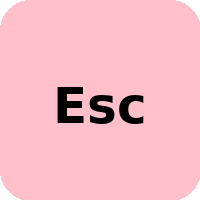 |   |    |   |
| 02 | F1 | 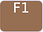 |   |    |   |
| 03 | F2 |  |   |    |   |
| 04 | F3 |  |   |    |   |
| 05 | F4 | 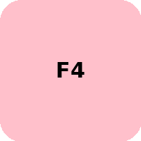 |   |    |   |
| 06 | F5 | 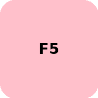 |   |    |   |
| 07 | F6 |  |   |    |   |
| 08 | F7 |  |   |    |   |
| 09 | F8 | 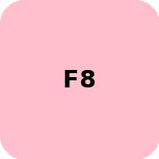 |   |    |   |
| 10 | F9 | 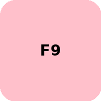 |   |    |   |
| 11 | F10 | 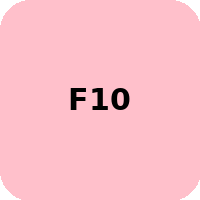 |   |    |   |
| 12 | F11| 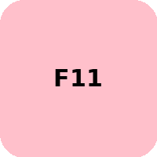 |   |    |   |
| 13 | F12 | 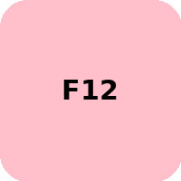 |   |    |   |
| 14 | PrintScreenSysRq |  |   |    |   |
| 15 | ScrollLock |  |   |    |   |
| 16 | PauseBreak |  |   |    |   |
| 17 | ESC |  |   |    |   |
| 18 | ESC |  |   |    |   |
| 19 | ESC |  |   |    |   |
| 20 | ESC |  |   |    |   |
| 21 | ESC |  |   |    |   |
| 22 | ESC |  |   |    |   |
| 23 | ESC |  |   |    |   |
| 24 | ESC |  |   |    |   |
| 25 | ESC |  |   |    |   |
| 26 | ESC |  |   |    |   |
| 27 | ESC |  |   |    |   |
| 28 | ESC |  |   |    |   |
| 29 | ESC | 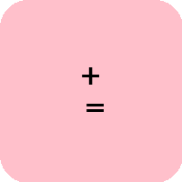 |   |    |   |
| 30 | ESC |  |   |    |   |
| 31 | ESC |  |   |    |   |
| 32 | ESC |  |   |    |   |
| 33 | ESC |  |   |    |   |
| 34 | ESC |  |   |    |   |
| 35 | ESC | 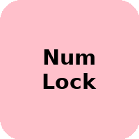 |   |    |   |
| 36 | ESC | 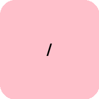 |   |    |   |
| 37 | ESC |  |   |    |   |
| 38 | ESC |  |   |    |   |
| 39 | ESC | 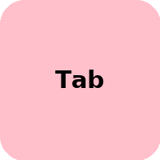 |   |    |   |
| 40 | ESC | 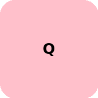 |   |    |   |
| 41 | ESC | 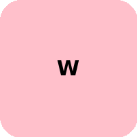 |   |    |   |
| 42 | ESC | 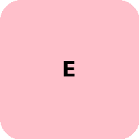 |   |    |   |
| 43 | ESC | 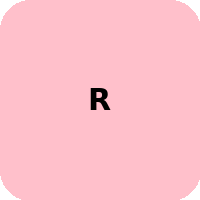 |   |    |   |
| 44 | ESC |  |   |    |   |
| 45 | ESC | 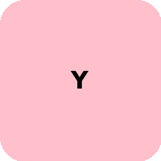 |   |    |   |
| 46 | ESC |  |   |    |   |
| 47 | ESC |  |   |    |   |
| 48 | ESC |  |   |    |   |
| 49 | ESC | 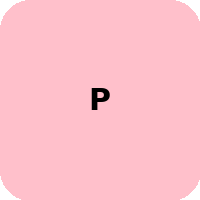 |   |    |   |
| 50 | ESC | 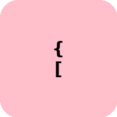 |   |    |   |
| 51 | ESC | 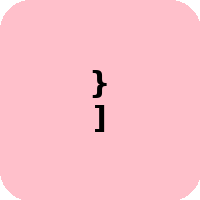 |   |    |   |
| 52 | ESC |  |   |    |   |
| 53 | ESC |  |   |    |   |
| 54 | ESC | 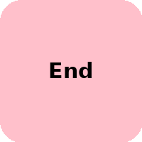 |   |    |   |
| 55 | ESC |  |   |    |   |
| 56 | ESC | 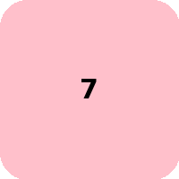 |   |    |   |
| 57 | ESC | 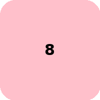 |   |    |   |
| 58 | ESC |  |   |    |   |
| 59 | ESC | 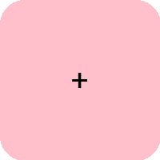 |   |    |   |
| 60 | ESC |  |   |    |   |
| 61 | ESC | 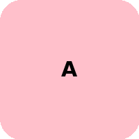 |   |    |   |
| 62 | ESC |  |   |    |   |
| 63 | ESC | 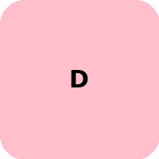 |   |    |   |
| 64 | ESC | 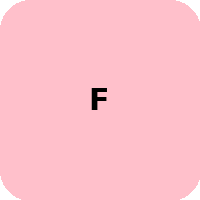 |   |    |   |
| 65 | ESC | 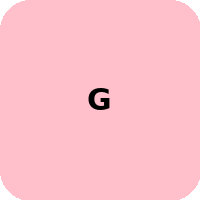 |   |    |   |
| 66 | ESC | 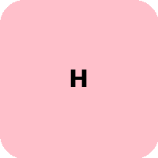 |   |    |   |
| 67 | ESC |  |   |    |   |
| 68 | ESC |  |   |    |   |
| 69 | ESC | 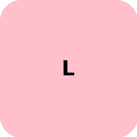 |   |    |   |
| 70 | ESC | 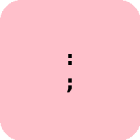 |   |    |   |
| 71 | ESC | 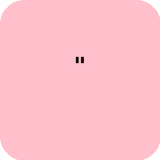 |   |    |   |
| 72 | ESC | 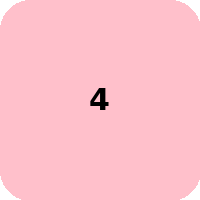 |   |    |   |
| 73 | ESC | 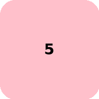 |   |    |   |
| 74 | ESC | 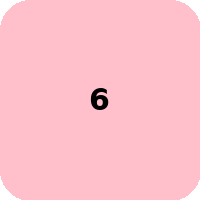 |   |    |   |
| 75 | ESC |  |   |    |   |
| 76 | ESC |  |   |    |   |
| 77 | ESC | 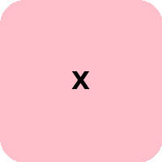 |   |    |   |
| 78 | ESC | 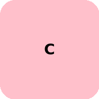 |   |    |   |
| 79 | ESC | 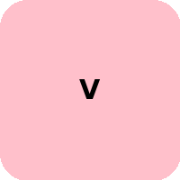 |   |    |   |
| 80 | ESC | 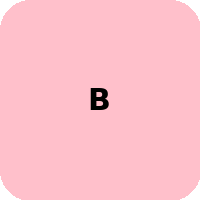 |   |    |   |
| 81 | ESC | 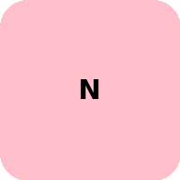 |   |    |   |
| 82 | ESC | 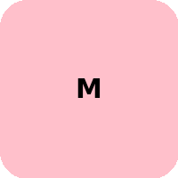 |   |    |   |
| 83 | ESC | 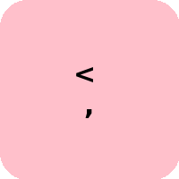 |   |    |   |
| 84 | ESC | 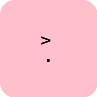 |   |    |   |
| 85 | ESC | 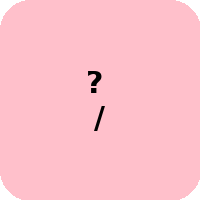 |   |    |   |
| 86 | ESC | 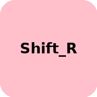 |   |    |   |
| 87 | ESC |  |   |    |   |
| 88 | ESC |  |   |    |   |
| 89 | ESC | 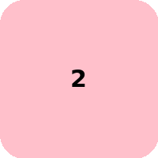 |   |    |   |
| 90 | ESC | 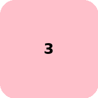 |   |    |   |
| 91 | ESC |  |   |    |   |
| 92 | ESC |  |   |    |   |
| 93 | ESC |  |   |    |   |
| 94 | ESC | 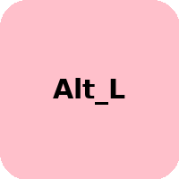 |   |    |   |
| 95 | ESC |  |   |    |   |
| 96 | ESC | 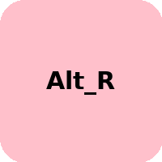 |   |    |   |
| 97 | ESC |  |   |    |   |
| 98 | ESC |  |   |    |   |
| 99 | ESC |  |   |    |   |
| 100 | ESC |  |   |    |   |
| 101 | ESC |  |   |    |   |
| 102 | ESC |  |   |    |   |
| 103 | ESC |  |   |    |   |
| 104 | ESC |  |   |    |   |

### SCAN COPY

  
  
  

  
  
  

## Trace lines

  
  
  
  
  

**ADv**

https://github.com/ultimatehackingkeyboard

