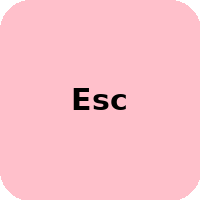
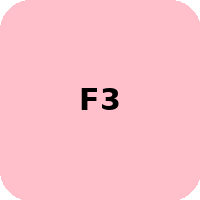

# KeyboardHack

I tried scanning the transparent sheet of the TVS keyboard PCB, but it didn’t scan effectively.
So, I decided to place a colored sheet underneath and then scanned the keyboard PCB layers.
Now, it looks perfect.

## KEYS 104

| Key_Number | Key_Name | Key_Image| Pin_Number_Top  | Pin_Number_Bot  | Pin_Description |
| --- |  --- | --- | --- |  --- | --- |
| 01 | ESC |  |   |    |   |
| 02 | F1 |  |   |    |   |
| 03 | F2 |  |   |    |   |
| 04 | F3 |  |   |    |   |
| 05 | F4 |  |   |    |   |
| 06 | F5 |  |   |    |   |
| 07 | F6 |  |   |    |   |
| 08 | F7 |  |   |    |   |
| 09 | F8 |  |   |    |   |
| 10 | F9 |  |   |    |   |
| 11 | F10 |  |   |    |   |
| 12 | F11|  |   |    |   |
| 13 | F12 |  |   |    |   |
| 14 | PrintScreenSysRq |  |   |    |   |
| 15 | ScrollLock |  |   |    |   |
| 16 | PauseBreak |  |   |    |   |
| 17 | ESC |  |   |    |   |
| 18 | ESC |  |   |    |   |
| 19 | ESC |  |   |    |   |
| 20 | ESC |  |   |    |   |
| 21 | ESC |  |   |    |   |
| 22 | ESC |  |   |    |   |
| 23 | ESC |  |   |    |   |
| 24 | ESC |  |   |    |   |

### SCAN COPY

  
  
  

  
  
  

## Trace lines

  
  
  
  
  

**ADv**

https://github.com/ultimatehackingkeyboard

